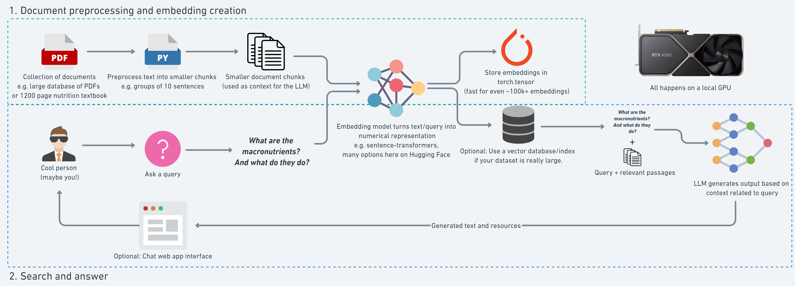

# Retrieval Augmented Generation FastAPI - Celery - Horizontal Scaling


## This project will resolve:
1. Provide a full solution to build a **RAG system in an enterprise with your own data without pre-training and fine-tuning (Costly)**.
2. **Host yourself**: You can set up on your on-premises server or other cloud providers.
3. Use **both GPU and CPU** to improve performance.
4. Many deployment solutions: **k8s, AWS, Docker, horizontal scaling**.

## Tech stack
- RAG architecture.
- FastAPI: Main thread handles requests.
- Celery Worker handles embedding documents then stores them to VectorDB.
- Qdrant as a VectorDB to store embeddings.
- Vietnamese LLM sentence-transformer. (sup-SimCSE-VietNamese-phobert-base)
- Docker, K8S, Aws.

## Compare Pricing: Self-Host vs. Cloud (OpenAI API)
| Feature                | Self-Host                          | Cloud (OpenAI API)               |
|------------------------|------------------------------------|----------------------------------|
| **Initial Setup Cost** | High (Hardware, Setup, Maintenance)| Low (Pay-as-you-go)              |
| **Operational Cost**   | Variable (Electricity, Upkeep)     | Fixed (Subscription/Usage Fees)  |
| **Scalability**        | Requires Manual Scaling            | Automatic Scaling                |
| **Performance**        | Customizable (Depends on Hardware) | Optimized by Provider            |
| **Data Privacy**       | High (Data Stays On-Premises)      | Variable (Depends on Provider)   |
| **Maintenance**        | Requires In-House Team             | Managed by Provider              |
| **Flexibility**        | High (Full Control)                | Limited (Provider Constraints)   |

## Minimum hardware requirement:
To run this project efficiently, the following minimum hardware requirements are recommended:
- **CPU**: >= 2 cores
- **RAM**: >= 4 GB
- **GPU**: NVIDIA GPU with at least >= 2 GB VRAM (for GPU acceleration - optional)
- **Storage**: >= 6 GB SSD (Contain source code and database)


## Workflow:
1. **Data Ingestion**: Documents are ingested and sent to the Celery worker.
2. **Embedding Creation**: The Celery worker uses the Vietnamese LLM sentence-transformer to create embeddings for the documents.
3. **Storage**: The embeddings are stored in Qdrant VectorDB.
4. **Query Handling**: FastAPI handles incoming queries and retrieves relevant embeddings from Qdrant VectorDB.
5. **Response Generation**: The retrieved embeddings are used to generate accurate and contextually appropriate responses.

This workflow ensures efficient processing and retrieval of information, leveraging both GPU and CPU resources for optimal performance.

## Run Locally
### Run in dev container
To run this project on your local machine, follow these steps:
- Make sure your PC installed docker and VS code extentions DevContainer
- `Ctrl` + `Shift` + `P` then Search Reopen in DevContainer (Waiting for image downloaded then run following step)

1. **Install Dependencies**: (about 10 minutes :)

```bash
  pip3 install -r requirements.txt
```

2. **Start FastAPI Server**:
By default your application will runing at `http://localhost:8000/docs`
  ```bash
  uvicorn main:app --reload
  ```
3. **Start Celery Worker**:
It will connect to redis container inside DevContainer
  ```bash
  celery -A worker.celery_worker.celery_app worker --loglevel=info
  ```
These commands will set up the necessary environment and start the services required for the project to function locally.

## Setup cluster:
### Docker:
### K8S:
### AWS:
## See our benchmark:

## Concept:
### What is RAG?
Retrieval-Augmented Generation (RAG) is a technique that combines retrieval-based and generation-based methods to improve the quality and relevance of generated text. It retrieves relevant documents from a knowledge base and uses them to generate more accurate and contextually appropriate responses.

### Sentence transformer:
A sentence transformer is a type of model used to convert sentences into dense vector representations. These vectors can then be used for various tasks such as semantic search, clustering, and classification. In this project, we use the Vietnamese LLM sentence-transformer (sup-SimCSE-VietNamese-phobert-base) to embed documents into vectors for efficient retrieval and processing.

### Vector embedding:
Vector embedding is the process of converting text into numerical vectors that capture the semantic meaning of the text. In this project, we use the Vietnamese LLM sentence-transformer (sup-SimCSE-VietNamese-phobert-base) to create embeddings for documents, which are then stored in Qdrant VectorDB for efficient retrieval.

### Retrieval:
Retrieval involves searching for and fetching relevant documents from a knowledge base. In this project, we use the embeddings stored in Qdrant VectorDB to quickly find documents that are most relevant to the input query, improving the accuracy and relevance of the generated responses.

### Similarity search/vector search
Similarity search/vector search aims to find two vectors which are close together in high-demensional space. For example,
two pieces of similar text passed through an embedding model should have a high similarity score, whereas two pieces of text about
different topics will have a lower similarity score. Common similarity score measures are dot product and cosine similarity.

 
 
## Resources:
- [RAG 101: Demystifying Retrieval-Augmented Generation Pipelines](https://developer.nvidia.com/blog/rag-101-demystifying-retrieval-augmented-generation-pipelines/)